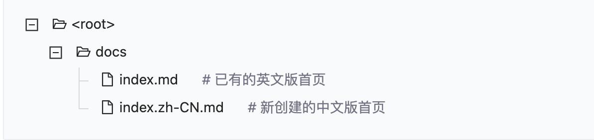

> 详见: [dumi 官网](https://d.umijs.org/zh-CN) 或见 [github/dumi](https://github.com/umijs/dumi) 以及 [lerna 文档](https://github.com/lerna/lerna)

## 设计背景

- 随着组件库逐渐扩大，日常的组件库管理以及文档管理日益庞大，且无法形成统一化的管理。

- 当使用组件时会面临不清楚组件的样子以及应用场景，dumi 则完美解决这些问题。

- dumi 做到文档统一化管理，组件可即时预览，可在撰写文档的同时渲染出组件以供预览。

- 由于组件采用 lerna 做统一管理，恰好 dumi 完美支持 lerna，因此使用 dumi+lerna 去管理组件库。

## 使用场景

当我们开发组件时，往往伴随着会编写组件使用文档，而普通文档在编辑器中查阅观赏度不高（无法预览组件），而 dumi 可以做到在 md 文档中预览组件

## 使用方法

- 使用 lerna 一键安装 packages 内各个组件依赖包

```bash
  $ npm install -g lerna;
$ lerna bootstrap;
```

- 启动项目

```bash
  $ npm run start;
```

## 目录结构

使用 dumi+lerna 做研发的组件库目录结构大致如下：

```markdown
├── docs // 文档目录
│ └── doc // 组件文档目录
│ │ ├── .md // 说明文档或 demo 文档
│ │ └── .md
│ └──index.md // 入口 md 文档
├── packages // 组件目录
│ ├── compoent1 // 当个组件包
│ ├── compoent2
├── .umirc.ts // dumi 配置文件
├── package.json // webpack 配置文件
————————————————
```

## 自定义导航、分组和标题

如果希望控制导航/分组/页面标题的生成，可以通过**在 Markdown 文件顶部**编写 FrontMatter 实现：

```markdown
---
title: 自定义页面名称
toc: 控制锚点目录的显示或位置，值为 false 时不展示，值为 content 时展示在内容区域的右侧（Affix Menu），值为 menu 时会将当前路由的锚点目录展示在左侧菜单中
nav:
  path: /自定义导航路由
  title: 自定义导航名称
  order: 控制导航顺序，数字越小越靠前，默认以路径长度和字典序排序
group:
  path: /自定义分组路由，注意，分组路由 = 导航路由 + 自己
  title: 自定义分组名称
  order: 控制分组顺序，数字越小越靠前，默认以路径长度和字典序排序
---
```

<!-- <API hideTitle src="../../demo/recommend/api.tsx"></API> -->

## 多语言

dumi 提供国际化文档方案，默认配置有 en 以及 zh 两种配置，使用方式也很简单，en 为默认语言，如要配置中文版，在文件后缀前新增 zh-CN 即可，例如：


dumi 会默认加载英文版文档作为页面，如果有其他语言或是多语言需求，可自行到根目录下的 .umirc.ts 目录下配置，例如：

````jsx | pure
// 多语言配置方式如下
navs: {
    'en-US': [
      null,  // null 值代表保留约定式生成的导航，只做增量配置
      { title: 'GitLab', path: 'http://gitlab.jusda.int/jusda-ui/dumi' },  // 自定义导航配置
    ],
    'zh-CN': [
      null,
      { title: 'GitLab', path: 'http://gitlab.jusda.int/jusda-ui/dumi' }, // 自定义导航配置
    ],
  }
// 单语言配置方式如下
  navs: [
    null, // null 值代表保留约定式生成的导航，只做增量配置
    {
      title: 'GitHub',
      path: 'https://github.com/umijs/dumi',
    },
    {
      title: '我有二级导航',
      path: '链接是可选的',
      // 可通过如下形式嵌套二级导航菜单，目前暂不支持更多层级嵌套：
      children: [
        { title: '第一项', path: 'https://d.umijs.org' },
        { title: '第二项', path: '/guide' },
      ],
    },
  ],
``` -->


## 使用lerna发布修改后的组件

  当我们编写完对应包的代码后, 使用 ``` lerna publish ``` 可一键检查发生更改后的组件并做统一发布

```base
$ lerna publish
````

一键将包发布到 npm 上, 此处根据我们选择的管理模式不同，所有 packages 的版本号都会根据 lerna.json 中的版本号进行更新。但我们需要注意的是 lerna 版本更新支持两种模式:

- 固定/锁定模式(默认, 指定版本号)

这种模式自动将所有 packages 包版本捆绑在一起，对任何其中一个或者多个 packages 进行重大改动都会导致所有 packages 的版本号进行更新。

- 独立模式(independent)

独立模式，init 的时候需要设置选项--independent。这种模式允许使用者对每个 package 单独改变版本号。每次执行 lerna publish 的时候，针对所有有更新的 package，会逐个询问需要升级的版本号，基准版本为它自身的 package.json 里面的版本号。这种情况下，lerna.json 的版本号不会变化， 默认为 independent。
我们可以在 lerna 初始化时指定:

```base
$ lerna init --independent
```
